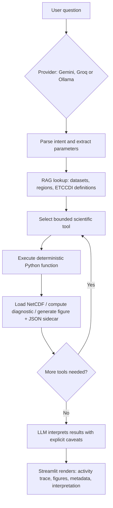

# Climate Extremes AI Agent

Live demo: https://climate-extremes-ai-agent.streamlit.app/

An agentic AI prototype for reproducible, interactive analysis of precipitation extremes and climate model evaluation. The dashboard puts an agentic AI layer in front of deterministic climate diagnostics: ask a question in plain language and a multi-provider LLM selects, runs and summarises the right tools. The LLM never performs the climate mathematics itself.

## Scope and disclaimer

This work is for **research and exploratory analysis only**. It is not a validated climate-science product, operational forecast tool, or substitute for peer-reviewed scientific analysis. The outputs are intended to illustrate how an agentic AI interface can make established climate diagnostics more accessible while keeping all numerical calculations deterministic and reproducible. All extreme indices, bias metrics, trend statistics and maps are computed by checked-in Python / Xarray / SciPy functions; the LLM only orchestrates tool calls and interprets the returned results. Its interpretation is not independent scientific evidence and should not be treated as attribution.

## Agentic workflow

The agent is not a free-form chatbot. It is a bounded, ReAct-style tool-calling system with access to a fixed registry of climate-analysis tools:



The available tools are:

- Compute and plot ETCCDI extreme indices (RX1day, RX5day, R95p) from daily data.
- Plot 20-year mean precipitation and CMIP6-minus-CPC bias maps (Germany or global).
- Compute 20-year area-mean precipitation trends over Germany.
- Compare observed vs modelled precipitation at a single point.
- Fit a linear trend with p-value, R-squared and 95% CI.
- Compute spatial pattern correlation and quantitative bias metrics (RMSE, MAE).
- Fit statistical distributions (gamma, Weibull, Gumbel, etc.) to precipitation samples.
- Answer factual questions from the embedded knowledge base (RAG).
- Run a sandboxed xarray/matplotlib script as a fallback code interpreter.

The agent shows its execution trace and is instructed to always state data limitations.

## Data sources

| Dataset | Coverage | Resolution | Period |
|---|---|---|---|
| CMIP6 MPI-ESM1-2-HR (historical `pr`) | Global / Germany | ~100 km | 2013 monthly; 1995-2014 monthly (Germany) |
| NOAA CPC Unified Gauge-Based Precip | Global / Europe / South Asia / Germany | ~0.5 deg | 2013 daily; 1995-2014 monthly (Germany) |

Only Germany has a multi-year (1995-2014) monthly record. Global and regional daily extremes are limited to 2013. The repository ships with ~15 MB of demo data so the Streamlit app works out of the box.

## AI models / providers

The LLM is used for orchestration and interpretation, not for numerical computation.

- **Gemini Flash** (Google): main diagnostic agent. Can also answer broader climate questions from training data.
- **Groq** (OpenAI-compatible): main diagnostic agent with model selection. Follows system instructions more strictly.
- **Ollama** (local): optional figure interpretation via vision models (Ministral 3, Gemma 4, Qwen 2.5-VL). Requires local model download.

Neither provider invents computed results for data that is not in the demo datasets.

## Project structure

```
ClimateDT_PrecipExtremes/
├── assets/                  # Pre-generated demo figures
├── dashboard/               # Streamlit application
│   ├── streamlit_app.py
│   └── .streamlit/          # Secrets and config
├── data/demo/               # Bundled NetCDF datasets (~15 MB)
├── figures/                 # Generated plots and JSON sidecars (gitignored)
├── scripts/                 # Download and batch processing scripts
├── src/
│   ├── ai/
│   │   ├── agent.py         # ReAct function-calling agent (Gemini / Groq)
│   │   ├── tools.py         # Diagnostic tool wrappers
│   │   ├── stats.py         # Statistical tools (regression, correlation, distribution)
│   │   ├── knowledge.py     # TF-IDF RAG vector store for climate metadata
│   │   ├── interpret.py     # AI figure interpretation
│   │   └── code_sandbox.py  # Sandboxed xarray code interpreter
│   ├── diagnostics/         # Precipitation and extreme indices
│   ├── plotting/            # Map and time-series plots (Cartopy)
│   └── utils/               # I/O and regridding helpers
├── environment.yml          # Conda environment (numpy < 2 pinned)
├── requirements.txt         # Pip requirements
└── packages.txt             # System packages for Streamlit Cloud
```

## Installation

```bash
conda env create -f environment.yml
conda activate climate-dt-precip
```

Or with pip:

```bash
pip install -r requirements.txt
```

**NumPy note:** NumPy >= 2.0 causes a fatal crash in Cartopy on Windows. Both `environment.yml` and `requirements.txt` pin `numpy < 2`.

## Configuration

API keys are read from Streamlit secrets or environment variables:

```toml
# dashboard/.streamlit/secrets.toml
GEMINI_API_KEY = "your-key-here"
GROQ_API_KEY = "your-key-here"
```

For Streamlit Community Cloud, add these under **Settings > Secrets**.

## Running the app

```bash
streamlit run dashboard/streamlit_app.py
```

The app has two tabs:

1. **General analysis** -- data overview, methodology and a curated gallery of pre-computed climatology, bias and extreme-index maps.
2. **Agentic Demo** -- ask a question in plain language and run the multi-provider function-calling agent live.

## Example questions

- "Calculate RX1day for South Asia in 2013 from the CPC dataset."
- "Compare CPC and CMIP6 2013 global mean precipitation and show the bias as a world map."
- "How does the 20-year precipitation trend over Germany compare between CPC and CMIP6?"
- "Compare observed and modelled monthly precipitation at Frankfurt from 1995 to 2014."
- "What is the spatial pattern correlation between CMIP6 and CPC global precipitation in 2013?"

## Limitations

- Prototype with limited spatial/temporal coverage: 2013 for daily extremes, 1995-2014 for Germany monthly data.
- `R95p` is computed from a 1-year record (2013), so it is a demonstration, not a robust ETCCDI percentile.
- No daily CMIP6 demo data; model-vs-observation extreme-index comparisons are not supported.
- The sandboxed code interpreter (`execute_xarray_script`) should not be treated as a primary scientific result.
- p-values from `linear_regression_analysis` do not account for serial autocorrelation.
- Single CMIP6 model realisation (MPI-ESM1-2-HR); no ensemble uncertainty.

## Future expansion

- ERA5 as an additional observational reference for Europe.
- Seasonal/annual cycle and interannual variability tools for Germany.
- Taylor diagrams and PDF comparisons for statistical validation.
- External data tools for teleconnection indices (NAO, ENSO, etc.).
- CI/CD with GitHub Actions for linting and tests.

## License

Research use only.

## Contact

For questions or collaboration see the GitHub repository.
